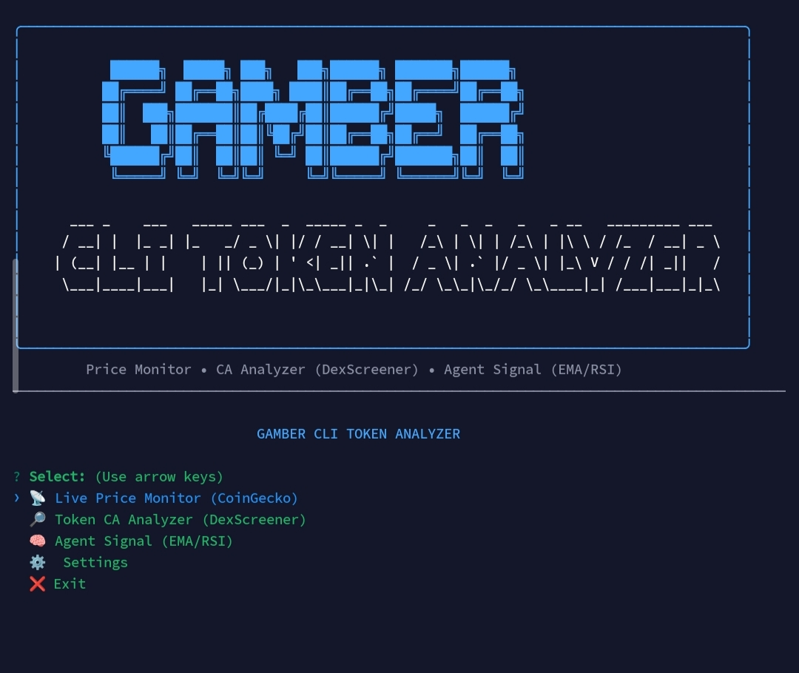
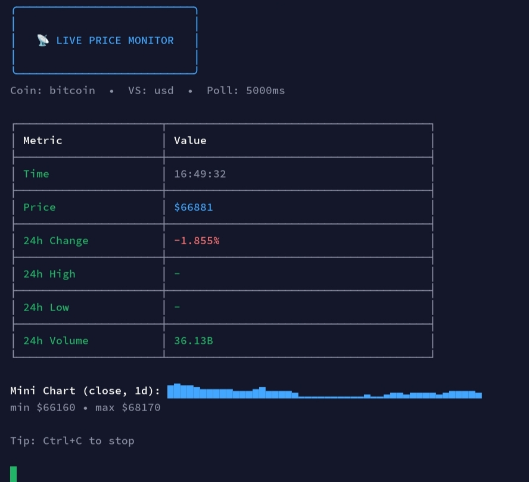
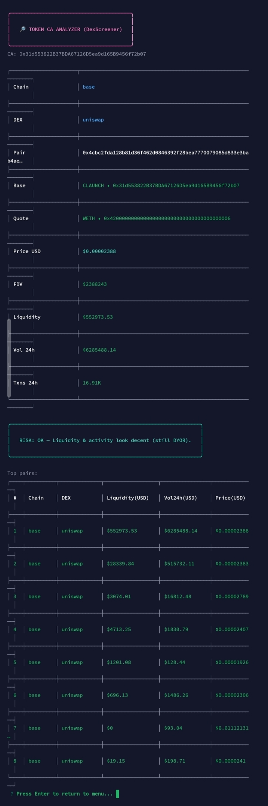
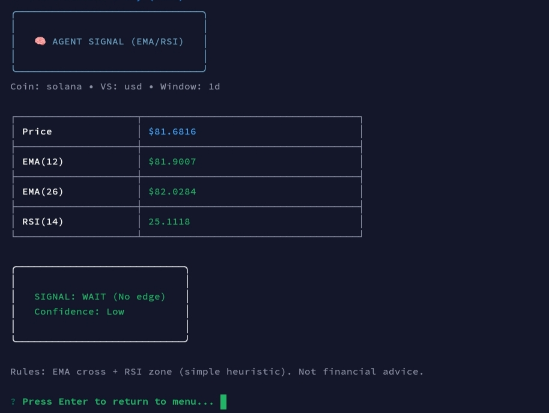

# ⚡ GAMBER CLI TOKEN ANALYZER

> Pro Terminal UI • Realtime Market • CA Scanner • Agent Signal (EMA/RSI)

### 🔗 Trac Address
trac19q7vm8e97naddcu7ss46m5hv980kyx5zqw2e3pe4w8e3xkj73xdq0y4xsn

Built for Intercom Task (Trac Systems)

---

## 🧠 Overview

GAMBER CLI TOKEN ANALYZER is a terminal-based tool with a centered pro UI layout, designed to:

- Monitor real-time crypto prices (CoinGecko)
- Analyze tokens using Contract Address / Mint (DexScreener)
- Generate trading signals using EMA + RSI
- Display mini charts directly in CLI

Runs fully in terminal / VPS — no GUI required.

---

## ✨ Features

- Centered professional CLI UI  
- Live price monitoring (auto refresh)  
- Token analysis by Contract Address (CA)  
- Liquidity, volume, FDV insights  
- Agent signal (BUY / SELL / WAIT)  
- ASCII mini chart  
- No API key required (public APIs)  

---

## 🖼️ Proof / Preview

### 🔷 Main UI (Centered Layout)

### 📡 Live Price Monitor

### 🔎 Token CA Analyzer

### 🧠 Agent Signal (EMA/RSI)

---

## 🚀 Installation

git clone https://github.com/gamber7/intercom-CLI-Analyze.git  
cd intercom-CLI-Analyze  
npm install  
cp .env.example .env  

---

## ▶️ Run

npm start  

or  

node index.js  

---

## 🧪 Usage

1) Live Price Monitor  
- Input: bitcoin, solana  
- Output: realtime price + mini chart  

2) Token CA Analyzer  
- Paste contract address from DexScreener / CMC / CoinGecko  
- Output: Chain, DEX, Liquidity, Volume, FDV  

3) Agent Signal  
- Input coin (example: solana)  
- Output: SIGNAL BUY / SELL / WAIT  

---

## ⚠️ Notes

- CoinGecko may return 429 (rate limit)  
- Uses public APIs (no API key required)  
- Not financial advice  

---

## 🔗 Repository

https://github.com/gamber7/intercom-CLI-Analyze

---

🔥 Built by GAMBER

