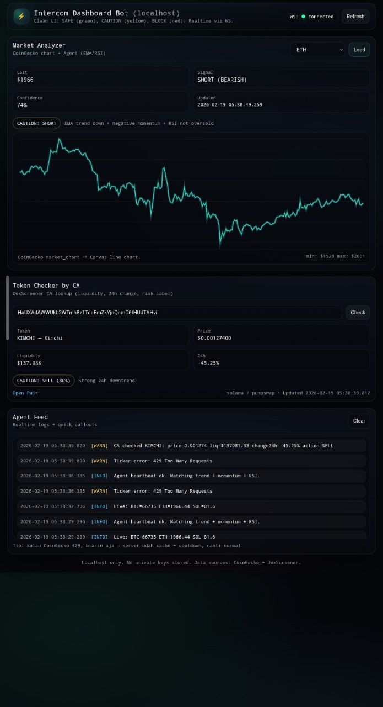
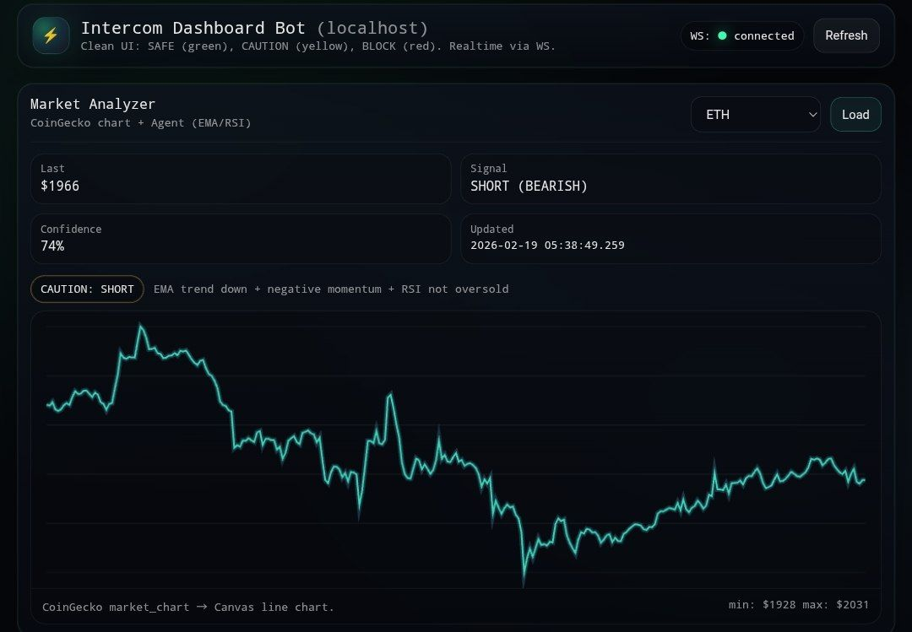
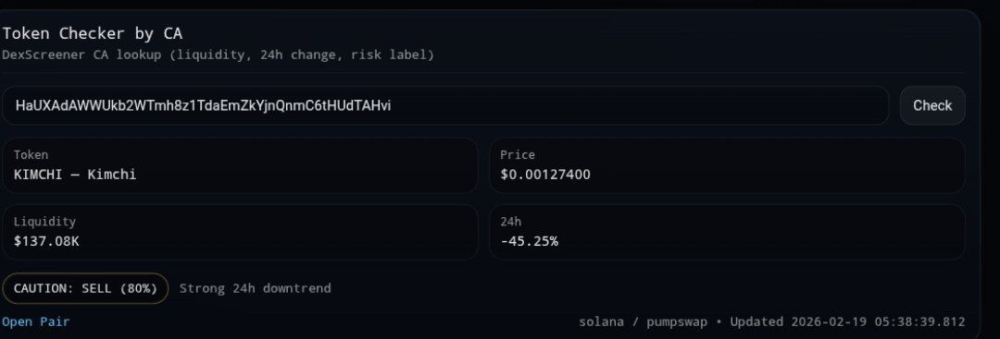
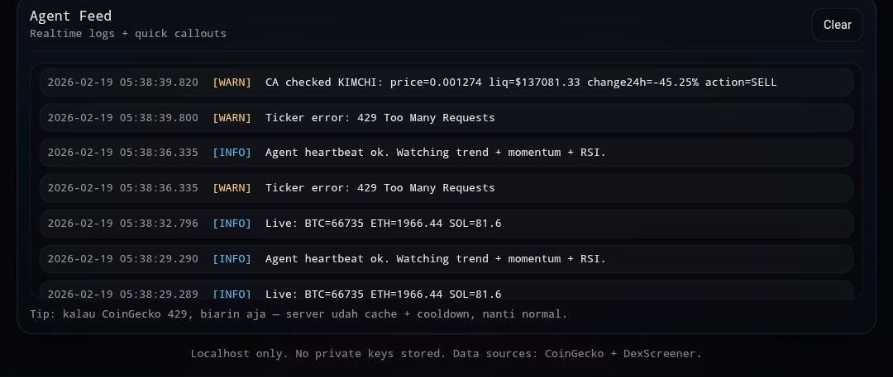

# ⚡ Intercom Real Price Analyzer

> Realtime Web Dashboard + Agent Signal + CA Token Scanner  
> Built for **Intercom Task (Trac Systems)**

---

## 🆔 Trac Identity

- **Trac Address**: trac1dl85m4zfwya0hgajw6r37s0dcvfct2cszs7wjw8fzp42stlx0dsqcp6zqy

---

## 🧠 Overview

This project is a **localhost-based trading dashboard** that provides:

- Real-time market data (CoinGecko)
- Token analysis via CA / Mint (DexScreener)
- Lightweight trading agent (EMA + RSI + Momentum)
- Realtime feed via WebSocket

All in a **clean dark UI (no CLI required)**.

---

## 🔗 Trac Integration

- **Sidechannels**: fast, ephemeral P2P messaging
- **SC-Bridge**: local WebSocket control for agents/tools
- **Protocol Ready**: deterministic state + agent communication
- **No CLI Needed**: fully web-based control

---

## ⚙️ Features

- ⚡ **Realtime Price Feed (WebSocket)**
- 🔎 **Token Checker by CA / Mint Address**
- 📊 **Auto Technical Analysis (EMA, RSI, Momentum)**
- 🤖 **Agent Signal (BUY / SELL / WAIT)**
- 🌐 **DexScreener Integration**
- 🎯 **Clean Dark UI (Pro Style)**

---

## 🧩 Architecture

```
Frontend (Vanilla JS UI)
        │
        ▼
Backend (Node.js + Express)
        │
        ├── CoinGecko API
        ├── DexScreener API
        └── WebSocket Server
```

---

## 🚀 Run Locally

### 1. Clone Repo

```bash
git clone https://github.com/comand87/intercom-agent-console.git
cd intercom-agent-console
```

### 2. Install Dependencies

```bash
npm install
```

### 3. Run Server

```bash
npm start
```

### 4. Open Dashboard

```
http://localhost:3000
```

---

## 🔍 Token Checker (CA)

Supports:

- Solana (Mint Address)
- EVM (Contract Address)

Returns:

- Price
- Liquidity
- Volume
- Pair info
- DexScreener link

---

## 🤖 Agent Logic

The trading agent uses:

- EMA crossover
- RSI threshold
- Momentum strength

### Signal Output:

- 🟢 BUY  
- 🔴 SELL  
- 🟡 WAIT  

---

## 📡 Realtime System

- WebSocket-based updates
- No refresh needed
- Lightweight + fast

---

## 🛡️ Safety

- No wallet required
- No transaction execution
- Read-only analysis mode
- Safe for testing tokens

---

## 📸 Proof (Live Dashboard)

### 💻 Full Dashboard View


### 🧠 Market Analyzer + Agent Signal


### 🔎 Token Checker (CA / Mint)


### 🤖 Agent Feed (Realtime Logs)


---

## 🧪 Future Upgrade

- SC-Bridge control panel
- Swap simulation
- Multi-chain support (SOL + EVM)
- Copy trading agent
- Rug / honeypot detector

---

## 📄 License

MIT License

---

## 👑 Credits

Built by **@comand87**  
For **Intercom Task - Trac Systems**

---

## 💥 Notes

This is a **functional demo + prototype** showcasing:

- Realtime data processing  
- Agent-based trading signals  
- SC-Bridge-ready architecture  

