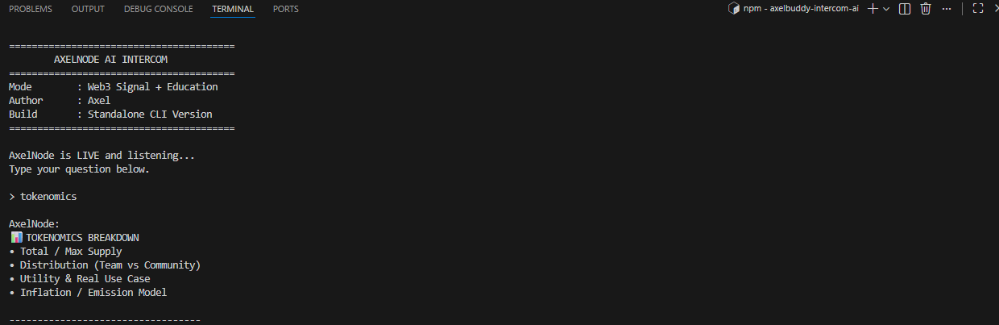

# AxelNode – AI Web3 Education Node

AxelNode is a custom-built Intercom node focused on Web3 safety and learning.

---

## Screenshoot



## 🔗 TRAC Address

AxelNode Intercom Identity:

TRAC Address:
trac1ldy25wuhv7vh6lxkp3vzmcc47y9wy25xr88gp32amtpxgn0hc8vqr5evd5


---

## 🚀 Features

- Tokenomics explanation
- Liquidity risk education
- Swap safety guidance
- Basic risk detection prompts
- Beginner-friendly Web3 onboarding

---

## 📦 Installation

```bash
npm start
